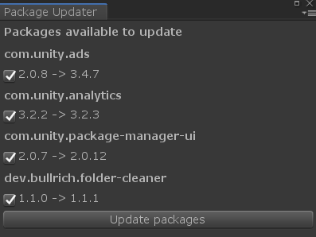

# Unity Package Updater

Utility to update several unity packages at once.



## Usage

Select `Window > Tools > Window/Tools/Update Packages` and check/uncheck the package you want to update.

The utility will not show you preview updates if the package version is not already in a preview version.

## Installation

### Using Open UPM

You can install this package using [OpenUPM](https://openupm.com/)'s command line tool:

`openupm add dev.bullrich.package-updater`

### Adding the package to the Unity project manifest

* Navigate to the `Packages` directory of your project.
* Adjust the [project manifest file][Project-Manifest] `manifest.json` in a text editor.
  * Ensure `https://registry.npmjs.org/` is part of `scopedRegistries`.
    * Ensure `dev.bullrich` is part of `scopes`.
  * Add `dev.bullrich.package-updater` to `dependencies`, stating the latest version.

  A minimal example ends up looking like this. 
  Please note that the version `X.Y.Z` stated here is to be replaced with the latest released version which is currently 
  [][OpenUPM].
  ```json
  {
    "scopedRegistries": [
      {
        "name": "npmjs",
        "url": "https://registry.npmjs.org/",
        "scopes": [
          "dev.bullrich"
        ]
      }
    ],
    "dependencies": {
      "dev.bullrich.package-updater": "X.Y.Z"
    }
  }
  ```
* Switch back to the Unity software and wait for it to finish importing the added package.

### Add editor test

If you want to ensure that all packages are always up to date, you can add the unit tests which 
ensures that there is no update available.

If you want to add this test to your project you can add it following this steps:

* Navigate to the `Packages` directory of your project.
* Adjust the [project manifest file][Project-Manifest] `manifest.json` in a text editor.
  * Ensure `dev.bullrich.package-updater` is part of `testables`.

  A minimal example ends up looking like this.
  ```json
  {
    "scopedRegistries": [
      ...
    ],
    "testables": [
      "dev.bullrich.package-updater"
    ],
    "dependencies": {
      ...
    }
  }
  ```

* In the Unity software select `Main Menu -> Window -> Test Runner`.
* Within the Test Runner window click on the `EditMode` tab and the click `Run All` button.
* If all the tests pass then the installation was successful.

[Project-Manifest]: https://docs.unity3d.com/Manual/upm-manifestPrj.html
[OpenUPM]: https://openupm.com/packages/dev.bullrich.package-updater/
[Enable-Tests]: https://docs.unity3d.com/Manual/cus-tests.html